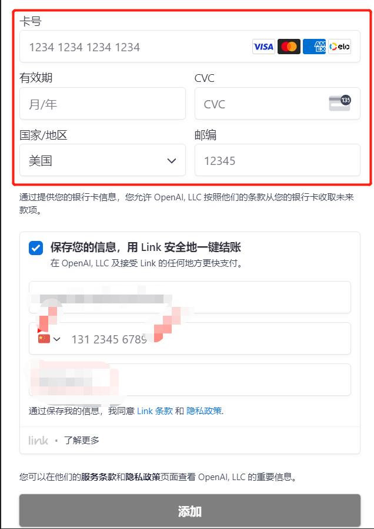

## 国内信用卡续费 ChatGPT PLUS 的办法

OpenAI 对于支付要求愈发严格，尤其 Depay卡关联封号事件后，很多其他虚拟卡也出现了续费无法的问题。通过 `Stripe`Link 绑国内信用卡实现可靠稳定续费支付。

**前提条件是已成功绑卡过的ChatGPT帐号，且目前处于PLUS状态**

### 优点

- 通过 Stripe Link实现，均为官方路径内实现，相对安全.费用便宜基本按照实时汇率结算，无其他费用
- 续费方便成功绑卡后，自动扣款续费，无需提供链接进行绑卡

### 准备

1. 国内带有VISA, MASTER全币种信用 或者美国运通标志的卡。
2. IP环境使用美国节点
3. 国内手机号

### 具体操作——ChatGPT帐号，且处于PLUS状态

#### LINK帐号注册

首先我们要记录账单信息邮编地址,后面填写信息时会用到，登录 [chatGpt](https://chat.openai.com) 官网 依次点击 **My plan** >> **Manage my subscription** >> **BILLING INFORMATION
** 打开GPT支付管理页面看到

.PNG)

点击添加支付方式

勾选Link选项✔,若没有出现 Link 选项，页面刷新几次。还是不行的话，更换节点后刷新

> 注意：在这里暂时不用去填卡片信息！！

在手机号码区号选项选择 `China`，填写你的国内手机号码，邮箱不做修改，持卡人信息保持默认

填写国内信用卡信息卡号、有效期、CVC，国家请选择美国，邮编填写之前记下的邮编，和之前的账单地址信息保持一致

最后，点击添加，看是否成功

#### Link账号和验证

若成功添加，手机会接收到 Stripe 的短信说明你的手机号已经成功绑定了Link, 接着，Link会有一封验证邮件发你邮箱，点击验证下

#### 将支付方式设置为默认

点击我们添加的支付方式旁边的三个小点，设为默认值

> 设置成功最终该支付方式旁边会显示默认 + `Link` 标志。

### 续费扣款的时间点

等到续费日等待完成扣款，并续费成功。比如上个月的PLUS是在6/15中午12点支付的，系统一般会在7/15的13点去扣款。

