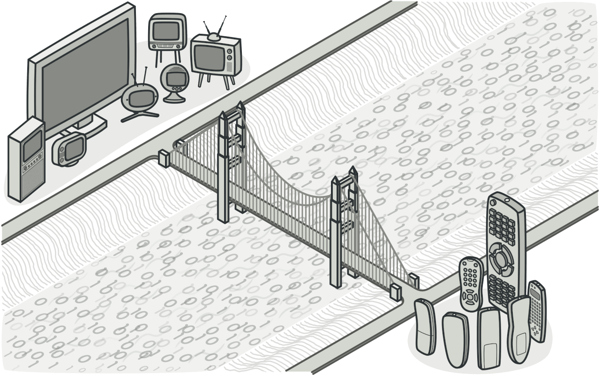

### 桥梁模式
桥梁模式 (bridge pattern) 是一种结构性设计模式，主要是将抽象与实现解耦，使得两者可以独立的变化
这种模式提供一种桥接结构，把抽象和实现分离开来，使得它可以独立的变化和扩展

桥接模式是一种结构型设计模式， 可将一个大类或一系列紧密相关的类拆分为抽象和实现两个独立的层次结构， 从而能在开发时分别使用。

### 问题
抽象？ 实现？ 听上去挺吓人？ 让我们慢慢来， 先考虑一个简单的例子。

假如你有一个几何 形状`Shape`类， 从它能扩展出两个子类： ​ 圆形`Circle`和 方形`Square` 。 
你希望对这样的类层次结构进行扩展以使其包含颜色， 所以你打算创建名为 红色`Red`和 蓝色`Blue`的形状子类。 
但是， 由于你已有两个子类， 所以总共需要创建四个类才能覆盖所有组合， 例如 蓝色圆形Blue­Circle和 红色方形Red­Square 。

>所有组合类的数量将以几何级数增长。

### 桥接模式解决的问题
所有组合类的数量将以几何级数增长。
在层次结构中新增形状和颜色将导致代码复杂程度指数增长。 例如添加三角形状， 你需要新增两个子类， 也就是每种颜色一个； 此后新增一种新颜色需要新增三个子类， 即每种形状一个。 如此以往， 情况会越来越糟糕。

在电商系统中我们考虑将商品和商品的显示方式，商品有不同的类型，如衣服、电子产品等，而显示方式也有多种，如网页显示、打印显示等。如果我们为每种商品和每种显示方式都创建一个子类，那么我们需要创建的类的数量就会非常多
而如果我们使用桥梁模式只需要为每种商品和每种显示方式各创建一个类，然后通过组合的方式来实现不同的功能

### 解决方案
问题的根本原因是我们试图在两个独立的维度——形状与颜色——上扩展形状类。 这在处理类继承时是很常见的问题。
桥接模式通过将继承改为组合的方式来解决这个问题。 具体来说， 就是抽取其中一个维度并使之成为独立的类层次， 这样就可以在初始类中引用这个新层次的对象， 从而使得一个类不必拥有所有的状态和行为。

根据该方法， 我们可以将颜色相关的代码抽取到拥有 红色和 蓝色两个子类的颜色类中， 然后在 形状类中添加一个指向某一颜色对象的引用成员变量。 
现在， 形状类可以将所有与颜色相关的工作委派给连入的颜色对象。 这样的引用就成为了 形状和 颜色之间的桥梁。 此后， 新增颜色将不再需要修改形状的类层次， 反之亦然。

#### 抽象部分和实现部分
设计模式四人组的著作  在桥接定义中提出了抽象部分和实现部分两个术语。 我觉得这些术语过于学术了， 反而让模式看上去比实际情况更加复杂。 在介绍过形状和颜色的简单例子后， 我们来看看四人组著作中让人望而生畏的词语的含义。
抽象部分 （也被称为接口） 是一些实体的高阶控制层。 该层自身不完成任何具体的工作， 它需要将工作委派给实现部分层 （也被称为平台）。
注意， 这里提到的内容与编程语言中的接口或抽象类无关。 它们并不是一回事。
在实际的程序中， 抽象部分是图形用户界面 （GUI）， 而实现部分则是底层操作系统代码 （API）， GUI 层调用 API 层来对用户的各种操作做出响应。

一般来说， 你可以在两个独立方向上扩展这种应用：
* 开发多个不同的 GUI （例如面向普通用户和管理员进行分别配置）
* 支持多个不同的 API （例如， 能够在 Windows、 Linux 和 macOS 上运行该程序）。

在最糟糕的情况下， 程序可能会是一团乱麻， 其中包含数百种条件语句， 连接着代码各处不同种类的 GUI 和各种 API。

>在庞杂的代码中， 即使是很小的改动都非常难以完成， 因为你必须要在整体上对代码有充分的理解。 而在较小且定义明确的模块中， 进行修改则要容易得多。

你可以将特定接口-平台的组合代码抽取到独立的类中， 以在混乱中建立一些秩序。 但是， 你很快会发现这种类的数量很多。 类层次将以指数形式增长， 因为每次添加一个新的 GUI 或支持一种新的 API 都需要创建更多的类。

让我们试着用桥接模式来解决这个问题。 该模式建议将类拆分为两个类层次结构：
- 抽象部分： 程序的 GUI 层。
- 实现部分： 操作系统的 API。

>创建跨平台应用程序的一种方法

抽象对象控制程序的外观， 并将真实工作委派给连入的实现对象。 不同的实现只要遵循相同的接口就可以互换， 使同一 GUI 可在 Windows 和 Linux 下运行。

最后的结果是： 你无需改动与 API 相关的类就可以修改 GUI 类。 此外如果想支持一个新的操作系统， 只需在实现部分层次中创建一个子类即可。

### 桥接模式结构

> 1. 抽象部分 （Abstraction） 提供高层控制逻辑， 依赖于完成底层实际工作的实现对象。
> 2. 实现部分 （Implementation） 为所有具体实现声明通用接口。 抽象部分仅能通过在这里声明的方法与实现对象交互。
> 3. 具体实现 （Concrete Implementations） 中包括特定于平台的代码。
> 4. 精确抽象 （Refined Abstraction） 提供控制逻辑的变体。 与其父类一样， 它们通过通用实现接口与不同的实现进行交互。
> 5. 通常情况下， 客户端 （Client） 仅关心如何与抽象部分合作。 但是， 客户端需要将抽象对象与一个实现对象连接起来。

### 桥接模式适合应用场景
#### 如果你想要拆分或重组一个具有多重功能的庞杂类 （例如能与多个数据库服务器进行交互的类）， 可以使用桥接模式。

类的代码行数越多， 弄清其运作方式就越困难， 对其进行修改所花费的时间就越长。 一个功能上的变化可能需要在整个类范围内进行修改， 而且常常会产生错误， 甚至还会有一些严重的副作用。
桥接模式可以将庞杂类拆分为几个类层次结构。 此后， 你可以修改任意一个类层次结构而不会影响到其他类层次结构。 这种方法可以简化代码的维护工作， 并将修改已有代码的风险降到最低。

#### 如果你希望在几个独立维度上扩展一个类， 可使用该模式。

桥接建议将每个维度抽取为独立的类层次。 初始类将相关工作委派给属于对应类层次的对象， 无需自己完成所有工作。

#### 如果你需要在运行时切换不同实现方法， 可使用桥接模式。
当然并不是说一定要实现这一点， 桥接模式可替换抽象部分中的实现对象， 具体操作就和给成员变量赋新值一样简单。

顺便提一句， 最后一点是很多人混淆桥接模式和策略模式的主要原因。 记住， 设计模式并不仅是一种对类进行组织的方式， 它还能用于沟通意图和解决问题。

### 实现方式
1. 明确类中独立的维度。 独立的概念可能是： 抽象/平台， 域/基础设施， 前端/后端或接口/实现。
2. 了解客户端的业务需求， 并在抽象基类中定义它们。
3. 确定在所有平台上都可执行的业务。 并在通用实现接口中声明抽象部分所需的业务。
4. 为你域内的所有平台创建实现类， 但需确保它们遵循实现部分的接口。
5. 在抽象类中添加指向实现类型的引用成员变量。 抽象部分会将大部分工作委派给该成员变量所指向的实现对象。
6. 如果你的高层逻辑有多个变体， 则可通过扩展抽象基类为每个变体创建一个精确抽象。
7. 客户端代码必须将实现对象传递给抽象部分的构造函数才能使其能够相互关联。 此后， 客户端只需与抽象对象进行交互， 无需和实现对象打交道。

### 桥接模式优缺点
* ✔️ 你可以创建与平台无关的类和程序。
* ✔️ 客户端代码仅与高层抽象部分进行互动， 不会接触到平台的详细信息。
* ✔️ 开闭原则。 你可以新增抽象部分和实现部分， 且它们之间不会相互影响。
* ✔️ 单一职责原则。 抽象部分专注于处理高层逻辑， 实现部分处理平台细节。

- ❌ 对高内聚的类使用该模式可能会让代码更加复杂。

### 与其他模式的关系
* 桥接模式通常会于开发前期进行设计， 使你能够将程序的各个部分独立开来以便开发。 另一方面， 适配器模式通常在已有程序中使用， 让相互不兼容的类能很好地合作。
* 桥接、 状态模式和策略模式 （在某种程度上包括适配器） 模式的接口非常相似。 实际上， 它们都基于组合模式——即将工作委派给其他对象， 不过也各自解决了不同的问题。 模式并不只是以特定方式组织代码的配方， 你还可以使用它们来和其他开发者讨论模式所解决的问题。
* 你可以将抽象工厂模式和桥接搭配使用。 如果由桥接定义的抽象只能与特定实现合作， 这一模式搭配就非常有用。 在这种情况下， 抽象工厂可以对这些关系进行封装， 并且对客户端代码隐藏其复杂性。
* 你可以结合使用生成器模式和桥接模式： 主管类负责抽象工作， 各种不同的生成器负责实现工作。

### 真实世界示例
在本例中， 页面层作为抽象部分， 而渲染层则作为实现部分。 页面类的对象可用附加在该页面的渲染对象提供的基础元素合成特定种类的网页。 
由于两个层次相互独立， 你可以在不修改页面层的前提下添加一个新的渲染层类， 反之亦然。

~~~php
/**
 * The Abstraction.
 */
abstract class Page
{
    /**
     * @var Renderer
     */
    protected Renderer $renderer;

    /**
     * The Abstraction is usually initialized with one of the Implementation
     * objects.
     */
    public function __construct(Renderer $renderer)
    {
        $this->renderer = $renderer;
    }

    /**
     * The Bridge pattern allows replacing the attached Implementation object
     * dynamically.
     */
    public function changeRenderer(Renderer $renderer): void
    {
        $this->renderer = $renderer;
    }

    /**
     * The "view" behavior stays abstract since it can only be provided by
     * Concrete Abstraction classes.
     */
    abstract public function view(): string;
}

/**
 * This Concrete Abstraction represents a simple page.
 */
class SimplePage extends Page
{
    protected string $title;
    protected string $content;

    public function __construct(Renderer $renderer, string $title, string $content)
    {
        parent::__construct($renderer);
        $this->title = $title;
        $this->content = $content;
    }

    public function view(): string
    {
        return $this->renderer->renderParts([
            $this->renderer->renderHeader(),
            $this->renderer->renderTitle($this->title),
            $this->renderer->renderTextBlock($this->content),
            $this->renderer->renderFooter()
        ]);
    }
}

/**
 * This Concrete Abstraction represents a more complex page.
 */
class ProductPage extends Page
{
    protected Product $product;

    public function __construct(Renderer $renderer, Product $product)
    {
        parent::__construct($renderer);
        $this->product = $product;
    }

    public function view(): string
    {
        return $this->renderer->renderParts([
            $this->renderer->renderHeader(),
            $this->renderer->renderTitle($this->product->getTitle()),
            $this->renderer->renderTextBlock($this->product->getDescription()),
            $this->renderer->renderImage($this->product->getImage()),
            $this->renderer->renderLink("/cart/add/" . $this->product->getId(), "Add to cart"),
            $this->renderer->renderFooter()
        ]);
    }
}

/**
 * A helper class for the ProductPage class.
 */
class Product
{
    private string $id, 
    private string $title, 
    private string $description, 
    private string $image, 
    private float $price;

    public function __construct(
        string $id,
        string $title,
        string $description,
        string $image,
        float $price
    ) {
        $this->id = $id;
        $this->title = $title;
        $this->description = $description;
        $this->image = $image;
        $this->price = $price;
    }

    public function getId(): string { return $this->id; }

    public function getTitle(): string { return $this->title; }

    public function getDescription(): string { return $this->description; }

    public function getImage(): string { return $this->image; }

    public function getPrice(): float { return $this->price; }
}

/**
 * The Implementation declares a set of "real", "under-the-hood", "platform"
 * methods.
 *
 * In this case, the Implementation lists rendering methods that can be used to
 * compose any web page. Different Abstractions may use different methods of the
 * Implementation.
 */
interface Renderer
{
    public function renderTitle(string $title): string;

    public function renderTextBlock(string $text): string;

    public function renderImage(string $url): string;

    public function renderLink(string $url, string $title): string;

    public function renderHeader(): string;

    public function renderFooter(): string;

    public function renderParts(array $parts): string;
}

/**
 * This Concrete Implementation renders a web page as HTML.
 */
class HTMLRenderer implements Renderer
{
    public function renderTitle(string $title): string
    {
        return "<h1>$title</h1>";
    }

    public function renderTextBlock(string $text): string
    {
        return "
$text
";
    }

    public function renderImage(string $url): string
    {
        return "";
    }

    public function renderLink(string $url, string $title): string
    {
        return "<a href='$url'>$title</a>";
    }

    public function renderHeader(): string
    {
        return "<html><body>";
    }

    public function renderFooter(): string
    {
        return "</body></html>";
    }

    public function renderParts(array $parts): string
    {
        return implode("\n", $parts);
    }
}

/**
 * This Concrete Implementation renders a web page as JSON strings.
 */
class JsonRenderer implements Renderer
{
    public function renderTitle(string $title): string
    {
        return '"title": "' . $title . '"';
    }

    public function renderTextBlock(string $text): string
    {
        return '"text": "' . $text . '"';
    }

    public function renderImage(string $url): string
    {
        return '"img": "' . $url . '"';
    }

    public function renderLink(string $url, string $title): string
    {
        return '"link": {"href": "' . $url . '", "title": "' . $title . '"}';
    }

    public function renderHeader(): string
    {
        return '';
    }

    public function renderFooter(): string
    {
        return '';
    }

    public function renderParts(array $parts): string
    {
        return "{\n" . implode(",\n", array_filter($parts)) . "\n}";
    }
}

/**
 * The client code usually deals only with the Abstraction objects.
 */
function clientCode(Page $page)
{
    // ...

    echo $page->view();

    // ...
}

/**
 * The client code can be executed with any pre-configured combination of the
 * Abstraction+Implementation.
 */
$HTMLRenderer = new HTMLRenderer();
$JSONRenderer = new JsonRenderer();

$page = new SimplePage($HTMLRenderer, "Home", "Welcome to our website!");
clientCode($page);

$product = new Product("123", "Star Wars, episode1",
    "A long time ago in a galaxy far, far away...",
    "/images/star-wars.jpeg", 39.95);

$page = new ProductPage($HTMLRenderer, $product);
clientCode($page);

$page->changeRenderer($JSONRenderer);
echo "JSON view of a simple content page, with the same client code:\n";
clientCode($page);
~~~