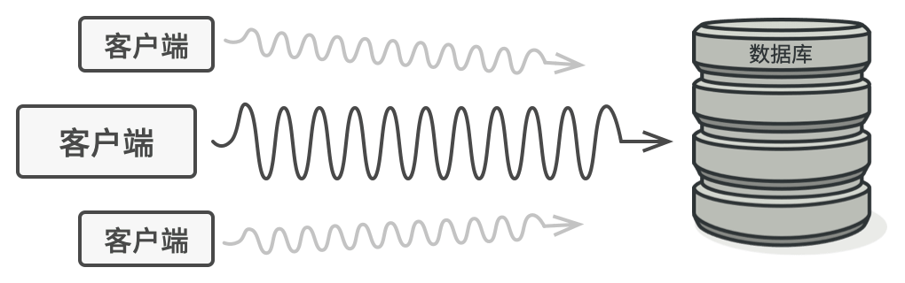
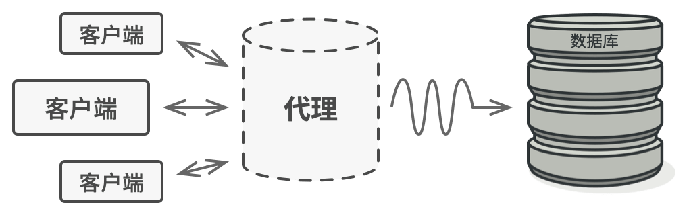
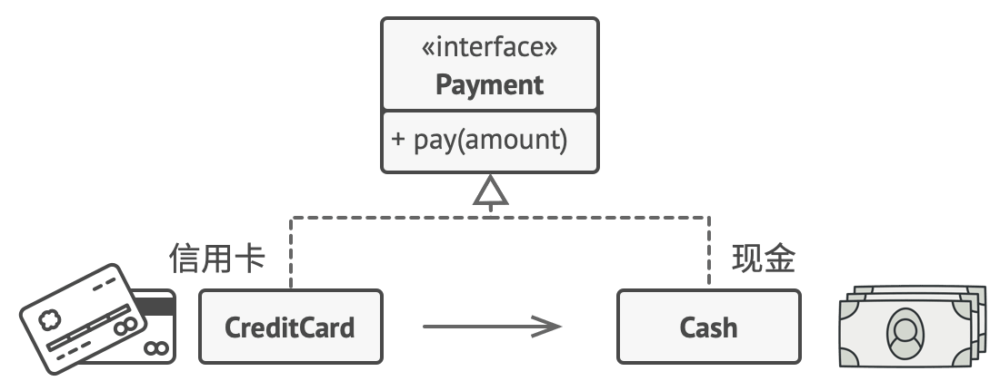

### 代理模式

代理模式是一种结构型设计模式，它提供了一个对象替代另一个对象来控制对它的访问。代理对象可以在客户端和目标对象之间起到中介的作用，并添加额外的功能。

代理模式是一种结构型设计模式， 让你能够提供对象的替代品或其占位符。 代理控制着对于原对象的访问， 并允许在将请求提交给对象前后进行一些处理。

- **复杂度**：⭐⭐
- **流行度**：⭐

**使用示例**： 责任链模式在 PHP 程序中并不常见， 因为它仅在代码与对象链打交道时才能发挥作用。 可以说在 PHP 中， 该模式最著名的例子之一是 PSR-15 中所描述的 HTTP 请求中间件

**识别方法**： 该模式可通过一组对象的行为方法间接调用其他对象的相同方法来识别， 而且所有对象都会遵循相同的接口。

### 问题
为什么要控制对于某个对象的访问呢？ 举个例子： 有这样一个消耗大量系统资源的巨型对象， 你只是偶尔需要使用它， 并非总是需要。

>数据库查询有可能会非常缓慢

你可以实现延迟初始化： 在实际有需要时再创建该对象。 对象的所有客户端都要执行延迟初始代码。 不幸的是， 这很可能会带来很多重复代码。

在理想情况下， 我们希望将代码直接放入对象的类中， 但这并非总是能实现： 比如类可能是第三方封闭库的一部分。

### 解决方案
代理模式建议新建一个与原服务对象接口相同的代理类， 然后更新应用以将代理对象传递给所有原始对象客户端。 
代理类接收到客户端请求后会创建实际的服务对象， 并将所有工作委派给它。

>代理将自己伪装成数据库对象， 可在客户端或实际数据库对象不知情的情况下处理延迟初始化和缓存查询结果的工作

这有什么好处呢？ 如果需要在类的主要业务逻辑前后执行一些工作， 你无需修改类就能完成这项工作。
由于代理实现的接口与原类相同， 因此你可将其传递给任何一个使用实际服务对象的客户端。

### 真实世界类比

>信用卡和现金在支付过程中的用处相同

信用卡是银行账户的代理， 银行账户则是一大捆现金的代理。 它们都实现了同样的接口， 均可用于进行支付。 消费者会非常满意， 因为不必随身携带大量现金； 商店老板同样会十分高兴， 因为交易收入能以电子化的方式进入商店的银行账户中， 无需担心存款时出现现金丢失或被抢劫的情况。

### 代理模式结构

> -服务接口 （Service Interface） 声明了服务接口。 代理必须遵循该接口才能伪装成服务对象。
> -服务 （Service） 类提供了一些实用的业务逻辑。
> -代理 （Proxy） 类包含一个指向服务对象的引用成员变量。 代理完成其任务 （例如延迟初始化、 记录日志、 访问控制和缓存等） 后会将请求传递给服务对象。
通常情况下， 代理会对其服务对象的整个生命周期进行管理。
> -客户端 （Client） 能通过同一接口与服务或代理进行交互， 所以你可在一切需要服务对象的代码中使用代理。

### 代理模式适合应用场景
使用代理模式的方式多种多样， 我们来看看最常见的几种。

代理模式通常有以下几种类型：
- 远程代理：它为一个对象在不同的地址空间提供局部代表。
- 虚拟代理：根据需要创建开销很大的对象。如果你有一个偶尔使用的重量级服务对象， 一直保持该对象运行会消耗系统资源时， 可使用代理模式。
- 保护代理：控制对原始对象的访问，适用于对象有不同的访问权限时。
- 智能引用代理：在访问对象时执行额外的动作，例如计算一个对象被引用的次数。
- 访问控制 （保护代理）: 如果你只希望特定客户端使用服务对象， 这里的对象可以是操作系统中非常重要的部分， 而客户端则是各种已启动的程序 （包括恶意程序）， 此时可使用代理模式。
- 记录日志请求 （日志记录代理）: 适用于当你需要保存对于服务对象的请求历史记录时。
- 缓存请求结果 （缓存代理）: 适用于需要缓存客户请求结果并对缓存生命周期进行管理时， 特别是当返回结果的体积非常大时。

### 实现方式
1. 如果没有现成的服务接口， 你就需要创建一个接口来实现代理和服务对象的可交换性。 从服务类中抽取接口并非总是可行的， 因为你需要对服务的所有客户端进行修改， 让它们使用接口。 备选计划是将代理作为服务类的子类， 这样代理就能继承服务的所有接口了。
2. 创建代理类， 其中必须包含一个存储指向服务的引用的成员变量。 通常情况下， 代理负责创建服务并对其整个生命周期进行管理。 在一些特殊情况下， 客户端会通过构造函数将服务传递给代理。
3. 根据需求实现代理方法。 在大部分情况下， 代理在完成一些任务后应将工作委派给服务对象。
4. 可以考虑新建一个构建方法来判断客户端可获取的是代理还是实际服务。 你可以在代理类中创建一个简单的静态方法， 也可以创建一个完整的工厂方法。
5. 可以考虑为服务对象实现延迟初始化。

### 代理模式优缺点
- ✔️你可以在客户端毫无察觉的情况下控制服务对象。
- ✔️如果客户端对服务对象的生命周期没有特殊要求， 你可以对生命周期进行管理。
- ✔️即使服务对象还未准备好或不存在， 代理也可以正常工作。
- ✔️开闭原则。 你可以在不对服务或客户端做出修改的情况下创建新代理。
- ❌代码可能会变得复杂， 因为需要新建许多类。
- ❌服务响应可能会延迟。

### 与其他模式的关系
- **适配器模式**能为被封装对象提供不同的接口， **代理模式**能为对象提供相同的接口， **装饰模式**则能为对象提供加强的接口。
- 外观模式与代理的相似之处在于它们都缓存了一个复杂实体并自行对其进行初始化。 代理与其服务对象遵循同一接口， 使得自己和服务对象可以互换， 在这一点上它与外观不同。
- 装饰和代理有着相似的结构， 但是其意图却非常不同。 这两个模式的构建都基于组合原则， 也就是说一个对象应该将部分工作委派给另一个对象。 两者之间的不同之处在于代理通常自行管理其服务对象的生命周期， 而装饰的生成则总是由客户端进行控制。

### 代码示例

~~~php

interface Image {
    public function display();
}

class RealImage implements Image {
    private $filename;

    public function __construct($filename) {
        $this->filename = $filename;
        $this->loadFromDisk();
    }

    private function loadFromDisk() {
        echo "Loading image: $this->filename\n";
    }

    public function display() {
        echo "Displaying image: $this->filename\n";
    }
}

class ProxyImage implements Image {
    private $realImage;
    private $filename;

    public function __construct($filename) {
        $this->filename = $filename;
    }

    public function display() {
        if ($this->realImage == null) {
            $this->realImage = new RealImage($this->filename);
        }
        $this->realImage->display();
    }
}

// Client code
$image1 = new ProxyImage("image1.jpg");
$image2 = new ProxyImage("image2.jpg");

// Image will be loaded and displayed
$image1->display();

// Image will be displayed without loading
$image1->display();

// Image will be loaded and displayed
$image2->display();

~~~

在这个例子中，我们有一个 Image 接口和一个 RealImage 类，RealImage 类在被创建时会加载图片。我们还有一个 ProxyImage 类，它也实现了 Image 接口，但是它在第一次显示图片时才会创建 RealImage 对象并加载图片，之后的显示操作则不会再次加载图片。

这样，我们就可以使用 ProxyImage 来控制对 RealImage 的访问，只有当真正需要显示图片时，我们才会加载图片。这可以提高程序的性能，特别是当图片的大小非常大或者加载图片的代价非常高时。